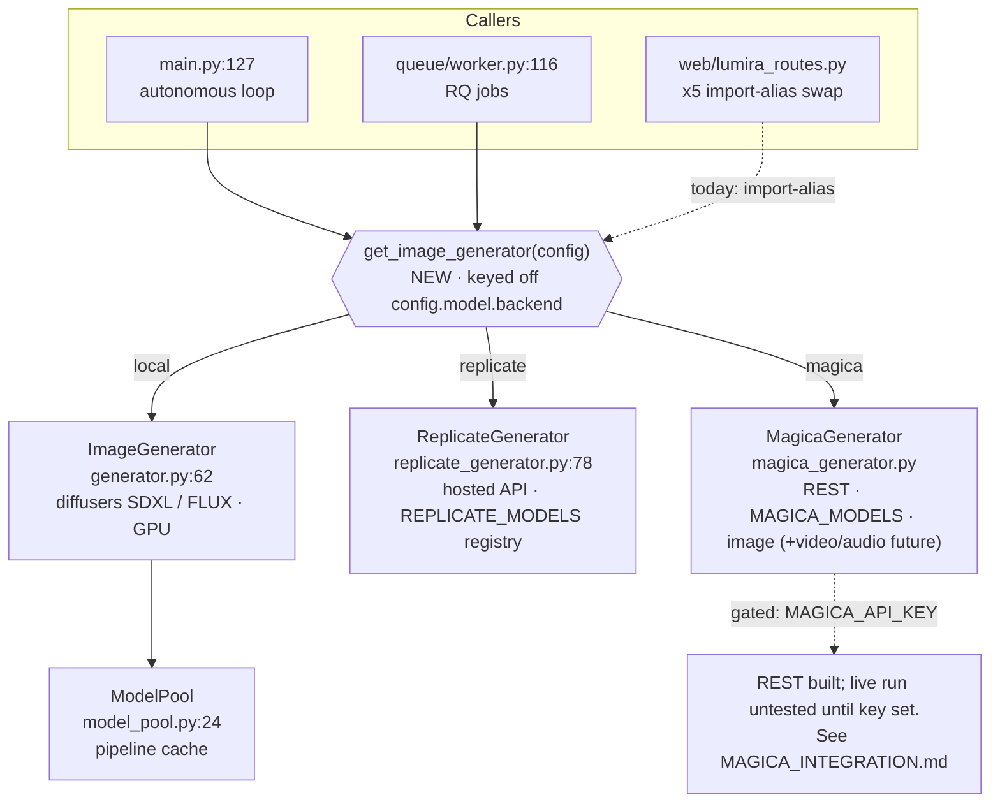

# Generator Backends

Snapshot as of 2026-07-28. Source: `src/ai_artist/core/`, `web/lumira_routes.py`, `queue/worker.py`.

Lumira's generation stage is duck-typed: any class exposing
`generate(prompt, ...) -> list[PIL.Image]` (plus `load_model()` / cleanup) can stand in.
Two concrete backends exist today; a hosted multi-model backend (Magica) is the planned third.

## Backend interface (duck-typed — no ABC yet)

| Method | local `ImageGenerator` | `ReplicateGenerator` | `MagicaGenerator` |
|--------|------------------------|----------------------|-----------------------------|
| `generate(prompt, ...) -> list[Image]` | ✅ `generator.py:471` | ✅ `replicate_generator.py:142` | ✅ `magica_generator.py` |
| `load_model()` | ✅ | ✅ | ✅ no-op (remote) |
| budget guard | n/a (local) | `_check_replicate_budget:52` | `_check_magica_budget` |
| model registry | `MoodModelConfig` `config.py:26` | `REPLICATE_MODELS:20` | `MAGICA_MODELS` |

## Selection

`config.model.backend` (`local` \| `replicate` \| `magica`, added 2026-07-28, default
`"local"`) selects the backend via `get_image_generator()` in `core/generator_factory.py`.
Behavior-preserving: unset -> local, matching prior hardwired behavior at `main.py:127` and
`worker.py:116`. `magica` requires `MAGICA_API_KEY`; see MAGICA_INTEGRATION.md.
