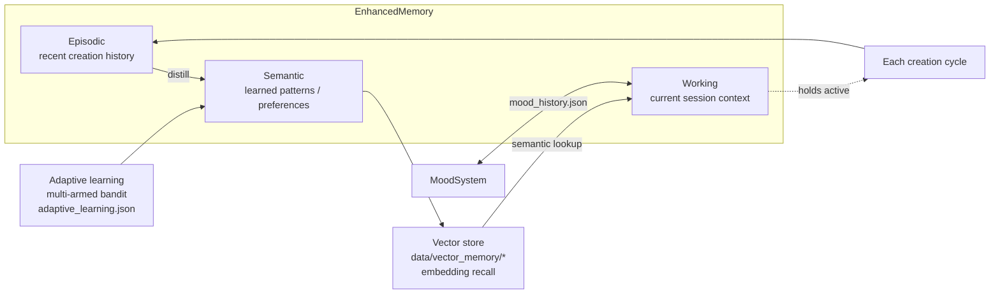

# Memory Architecture

Snapshot as of 2026-07-28. Source: `src/ai_artist/personality/`, `data/` state files.

Lumira's memory is three cooperating layers plus a vector store for semantic recall.
State persists to `data/*.json` and `data/vector_memory/` between runs.

## Persisted state files (`data/`)

| File | Layer |
|------|-------|
| `lumira_memory.json` | core memory |
| `lumira_enhanced_memory.json` | 3-layer enhanced memory |
| `lumira_mood_history.json` | mood trajectory |
| `adaptive_learning.json` | bandit weights |
| `thematic_series.json` | series continuity |
| `vector_memory/<id>/data_level0.bin` | vector index |

> NOTE: these are **runtime state**, currently git-tracked and churning on every run.
> See MAGICA_INTEGRATION.md "Repo hygiene" for the untrack decision.
