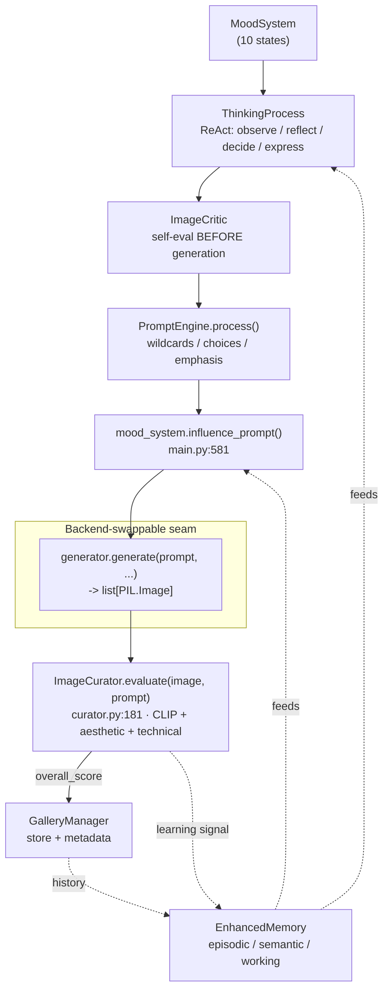

# Lumira Creation Pipeline

Snapshot as of 2026-07-28. Source: `src/ai_artist/main.py`, `personality/`, `curation/`.
Load into a session with `claude --append-system-prompt "$(cat AI/diagrams/**/*.md)"` to skip exploration turns.

The autonomous creation loop: an emotional state drives a visible reasoning process,
which shapes a prompt, which a generator renders, which a curator scores before the
gallery keeps it.

## Key call sites

| Stage | Code |
|-------|------|
| Mood -> model lookup | `main.py:602-604`, `generator.get_model_for_mood()` |
| Prompt build | `PromptEngine.process()` `prompt_engine.py:85` |
| Mood prompt mutation | `main.py:581` |
| Generation | `generator.generate()` `generator.py:471` |
| Scoring | `ImageCurator.evaluate()` `curator.py:181`, called `main.py:694` |

The generator is the only stage that swaps backend — see `generator-backends.md`.
